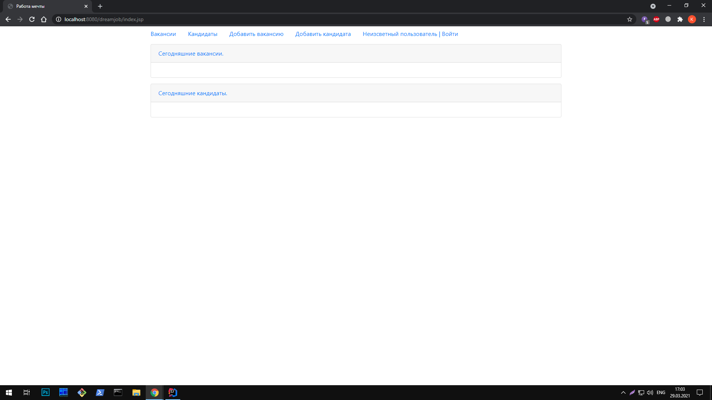
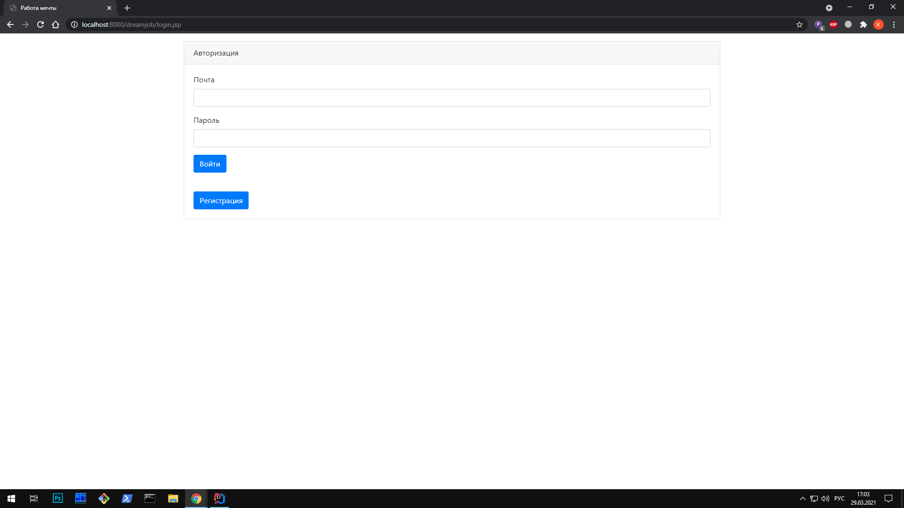
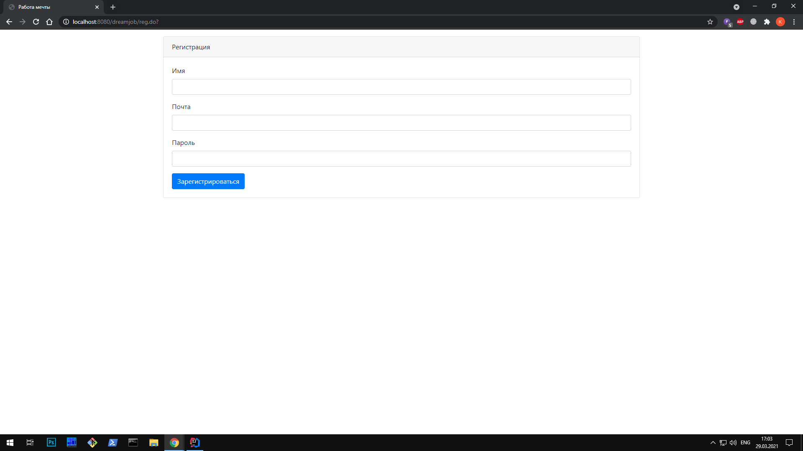
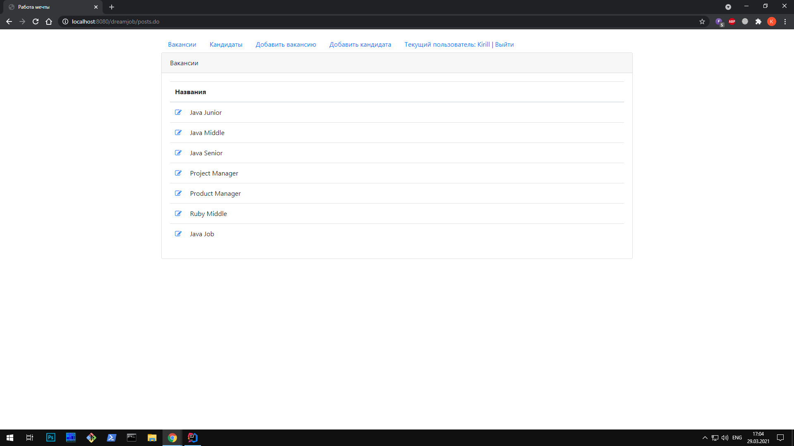
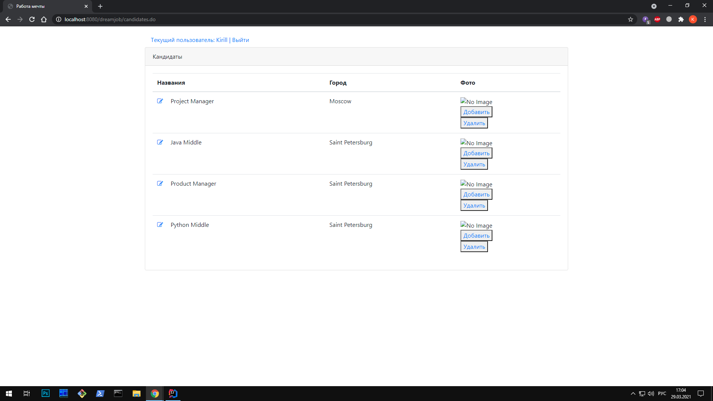
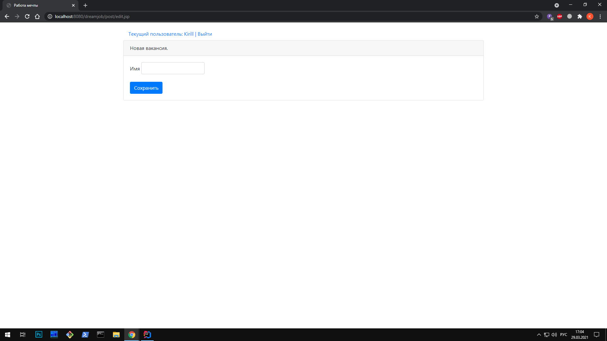
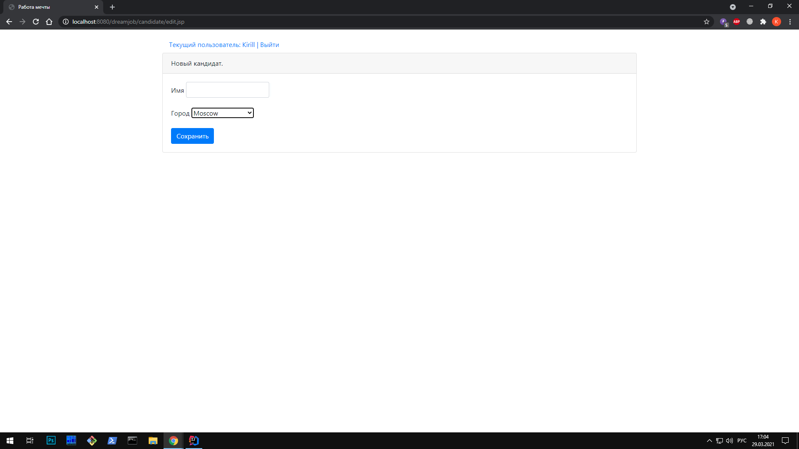

# job4j_dreamjob
## Проект "работа мечты"

### Используемые технологии
 * Java servlets
 * JSP, HTML
 * JDBC
 * PostgreSQL
 * Junit, Mockito
 * Log4j, Sl4J 
 * Maven
 * Apache Tomcat
 * Travis CI, CodeCov, CheckStyle
## Интрефейс приложения
### Основаня страница

### Страница авторизации

### Страница регистрации

### Страница вакансий

### Страница кандидатов

### Добавление вакансии

### Добавление кандидата

